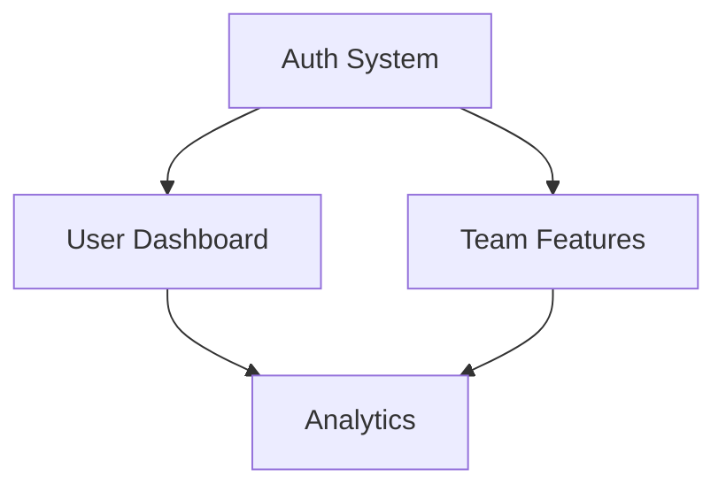

# Roadmap Command

Generate a prioritized product roadmap from requirements and current state.

## Phase 1: Gather Inputs

Launch these sub-agents **in parallel** using the Task tool:

### Agent 1: PRD Analysis
```
subagent_type: Explore
prompt: "Analyze the Product Requirements Document:
- Check docs/product/PRD.md
- Extract MVP features
- Extract future features
- Note any timelines or phases mentioned

Return structured list of features with priorities."
```

### Agent 2: GitHub Issues
```
subagent_type: Bash
prompt: "Gather open issues and their labels:
gh issue list --limit 100 --json number,title,labels,milestone

Categorize by:
- Feature requests
- Bug reports
- Enhancements
- Technical debt

Return categorized list with counts."
```

### Agent 3: Current State
```
subagent_type: Explore
prompt: "Analyze what's currently built:
- Check implemented features
- Identify gaps from PRD
- Note any WIP features

Return: Built, In Progress, Not Started"
```

### Agent 4: Dependencies
```
subagent_type: Explore
prompt: "Identify technical dependencies:
- What must be built before what?
- Any blocking infrastructure work?
- External dependencies (APIs, services)?

Return dependency map."
```

## Phase 2: Prioritization Framework

Ask user about prioritization approach:

```
"How would you like to prioritize the roadmap?

- Now/Next/Later (simple, flexible)
- RICE scoring (Reach, Impact, Confidence, Effort)
- MoSCoW (Must, Should, Could, Won't)
- Custom criteria"
```

### Now/Next/Later

```markdown
## Now (Current Sprint/Month)
High impact, low effort, or blocking other work

## Next (Next 1-3 Months)
Important features, medium effort

## Later (Future)
Nice-to-haves, large efforts, dependencies not ready
```

### RICE Scoring

```markdown
| Feature | Reach | Impact | Confidence | Effort | Score |
|---------|-------|--------|------------|--------|-------|
| Feature A | 1000 | 3 | 80% | 2 | 1200 |
| Feature B | 500 | 2 | 90% | 1 | 900 |

Score = (Reach × Impact × Confidence) / Effort
```

### MoSCoW

```markdown
## Must Have
Critical for launch, non-negotiable

## Should Have
Important but not critical

## Could Have
Nice to have if time permits

## Won't Have (This Release)
Explicitly out of scope
```

## Phase 3: Generate Roadmap

Based on analysis and prioritization:

```markdown
# Product Roadmap

**Generated**: [Date]
**Planning Horizon**: [Timeframe]

---

## Vision

[1-2 sentence product vision from PRD]

---

## Now (In Progress)

### [Feature Name]
- **Status**: [In Development / Testing / Review]
- **Owner**: [Team/Person]
- **Target**: [Date]
- **Description**: [Brief description]
- **Issues**: #1, #2, #3

### [Feature Name]
...

---

## Next (Planned)

### [Feature Name]
- **Priority**: [P0/P1/P2]
- **Effort**: [S/M/L/XL]
- **Dependencies**: [List]
- **Description**: [Brief description]
- **Issues**: #4, #5

### [Feature Name]
...

---

## Later (Future)

### [Feature Name]
- **Why Later**: [Reason - dependency, lower priority, etc.]
- **Description**: [Brief description]

---

## Not Doing

### [Feature Name]
- **Why Not**: [Out of scope reason]

---

## Dependencies



---

## Risks & Mitigations

| Risk | Impact | Mitigation |
|------|--------|------------|
| [Risk 1] | High | [Mitigation] |
| [Risk 2] | Medium | [Mitigation] |

---

## Success Metrics

| Milestone | Metric | Target |
|-----------|--------|--------|
| MVP Launch | Active Users | 100 |
| v1.0 | Retention | 40% |

---

## Review Schedule

- Weekly: Team sync on Now items
- Monthly: Roadmap review and reprioritization
- Quarterly: Strategic planning
```

## Phase 4: Interactive Refinement

Allow user to adjust:

```
"Here's the draft roadmap. Would you like to:

- Move items between Now/Next/Later
- Add items not captured
- Remove items
- Adjust priorities
- Approve and save"
```

## Phase 5: Output

Save roadmap to file:

```
docs/product/ROADMAP.md
```

Optionally create GitHub milestones:

```bash
# Create milestones
gh api repos/:owner/:repo/milestones -f title="v1.0 - MVP" -f due_on="2024-03-01"
gh api repos/:owner/:repo/milestones -f title="v1.1 - Polish" -f due_on="2024-04-01"

# Assign issues to milestones
gh issue edit 1 --milestone "v1.0 - MVP"
```

## Roadmap Formats

### Timeline View

```markdown
## Q1 2024
- [x] Auth System
- [ ] User Dashboard
- [ ] Basic Analytics

## Q2 2024
- [ ] Team Features
- [ ] Advanced Analytics
- [ ] API v2

## Q3 2024
- [ ] Mobile App
- [ ] Integrations
```

### Kanban View

```markdown
| Now | Next | Later |
|-----|------|-------|
| Auth | Teams | Mobile |
| Dashboard | Analytics | AI Features |
| Basic API | API v2 | Enterprise |
```

### Theme View

```markdown
## Theme: User Onboarding
- Sign up flow
- Onboarding wizard
- First-run experience

## Theme: Collaboration
- Team workspaces
- Sharing
- Comments
```

## Options

- `--format [timeline|kanban|theme]` — Output format
- `--horizon [quarter|year]` — Planning horizon
- `--include-issues` — Link to GitHub issues
- `--create-milestones` — Create GitHub milestones

## Related Commands

- `/prd` — Create/update product requirements
- `/release` — Execute a release from the roadmap
- `/competitive` — Inform roadmap with competitive analysis
